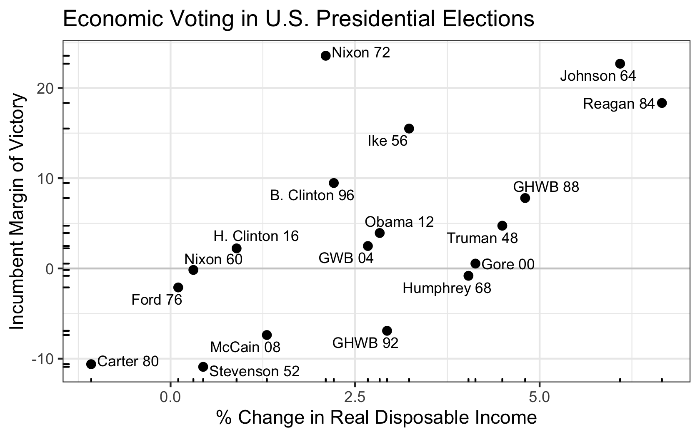

Data for Economic Models of U.S. Presidential Elections
================

This repository contains data to predict incumbent margin of victory in
U.S. presidential elections. The dataset covers presidential elections
from 1948 to 2016 and includes the economic predictors real disposable
income, GDP, and the unemployment rate.

## The Dataset

  - [data/economic-models.csv](data/economic-models.csv): the dataset
  - [data/dictionary.csv](data/dictionary.csv): the dataset dictionary

The table below summarizes the variables in the dataset

| Variable                    | Variable Name           | Description                                                                                                      |
| :-------------------------- | :---------------------- | :--------------------------------------------------------------------------------------------------------------- |
| Year                        | `year`                  | Year of the presidential election                                                                                |
| % Change in RDI Per Capita  | `ch_rdi`                | Percent change in real disposable income per capita from Q2 in the year prior to Q2 in the year of the election. |
| % Change in GDP Per Capita  | `ch_gpd`                | Percent change in GDP per capita from Q2 in the year prior to Q2 in the year of the election.                    |
| Unemployment Rate (%)       | `unemployment_rate`     | Seasonally adjusted unemployment rate for June in the year of the election.                                      |
| Incumbent Margin of Victory | `incumbent_margin`      | Difference between the incumbent party’s percent of the two-party votes and the challenger’s percent             |
| Winner                      | `winner_name`           | Name of the candidate that received the most votes                                                               |
| Winner                      | `winner_short_name`     | Abbreviated version of winner\_name                                                                              |
| Incumbent Party             | `incumbent_party`       | Party of current president                                                                                       |
| Incumbent                   | `incumbent_name`        | Name of the candidate from the incumbent pary. Not necessily the current president.                              |
| Incumbent                   | `incumbent_short_name`  | Abbreviated version of incumbent\_name                                                                           |
| Challenger                  | `challenger_name`       | Name of the candidate from the non-incumbent party.                                                              |
| Callenger                   | `challenger_short_name` | Abbreviated version of challenger\_name                                                                          |

## Data Sources

  - **Real Disposable Income**: FRED Series
    [A939RX0Q048SBEA](https://fred.stlouisfed.org/series/A939RX0Q048SBEA)
  - **GDP**: FRED series
    [A939RX0Q048SBEA](https://fred.stlouisfed.org/series/A939RX0Q048SBEA)
  - **unemployment**: FRED series
    [UNRATE](https://fred.stlouisfed.org/series/UNRATE)
  - **election results**: Dave Leip’s [*Atlas of U.S. Presidential
    Elections*](https://uselectionatlas.org/RESULTS/)
      - [Google
        Sheet](https://docs.google.com/spreadsheets/d/1Am1cZb9qJXjupfDxVDS0dmhGXb6RgNYONV14NOr8C3E/edit#gid=0)
        where I copied the relevant data
      - [CSV version on
        web](https://docs.google.com/spreadsheets/d/e/2PACX-1vS0RH-GoRJ7EVcPdLSYvUzLXwxyZGhfIvgOwjDdih4yM8mHJ4Fmz_7ADP43EsQHLq8AawXfJd7XgiOs/pub?gid=0&single=true&output=csv)
        for import

## Building

**Important Note**: The FRED API and fredr package requires
authorization via a key. In order to reproduce these results from
scratch, you must obtain a key from the FRED website and add the script
`R/api-keys.R` with the following line (just one):

    fredr::fredr_set_key("your_key_here")

### `makefile`

You can clean and rebuild the project by running `make clean` and then
`make` in a terminal.

### Building Manually

  - The scripts `R/get-*-data.R` obtain the raw datasets from the web
    and add a tidy version to `intermediate-data/`. (It also adds the
    raw versions and any metadata to `raw-data/` for completeness.)
  - The script `R/join-data.R` joins these tidy datasets together to
    create the dataset `data/economic-models.csv`.

## Variables

The table below shows an abbreviated version of the dataset.

| Year | Incumbent  | Challenger | % Change in RDI Per Capita | Incumbent Margin |
| ---: | :--------- | :--------- | -------------------------: | ---------------: |
| 1948 | Truman     | Dewey      |                       4.49 |             4.74 |
| 1952 | Stevenson  | Ike        |                       0.44 |          \-10.90 |
| 1956 | Ike        | Stevenson  |                       3.23 |            15.50 |
| 1960 | Nixon      | JFK        |                       0.31 |           \-0.17 |
| 1964 | Johnson    | Goldwater  |                       6.09 |            22.69 |
| 1968 | Humphrey   | Nixon      |                       4.04 |           \-0.81 |
| 1972 | Nixon      | McGovern   |                       2.10 |            23.57 |
| 1976 | Ford       | Carter     |                       0.10 |           \-2.10 |
| 1980 | Carter     | Reagan     |                     \-1.08 |          \-10.61 |
| 1984 | Reagan     | Mondale    |                       6.66 |            18.34 |
| 1988 | GHWB       | Dukakis    |                       4.80 |             7.80 |
| 1992 | GHWB       | B. Clinton |                       2.93 |           \-6.91 |
| 1996 | B. Clinton | Dole       |                       2.21 |             9.47 |
| 2000 | Gore       | GWB        |                       4.13 |             0.54 |
| 2004 | GWB        | Kerry      |                       2.67 |             2.49 |
| 2008 | McCain     | Obama      |                       1.30 |           \-7.38 |
| 2012 | Obama      | Romney     |                       2.83 |             3.93 |
| 2016 | H. Clinton | Trump      |                       0.89 |             2.23 |
